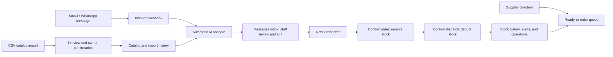
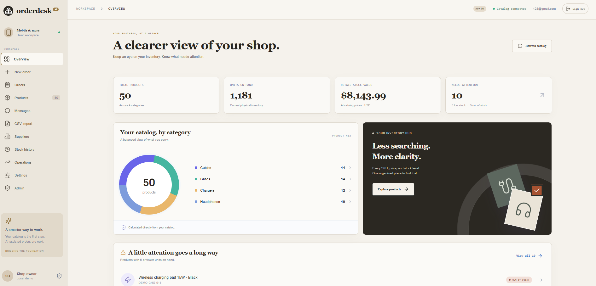
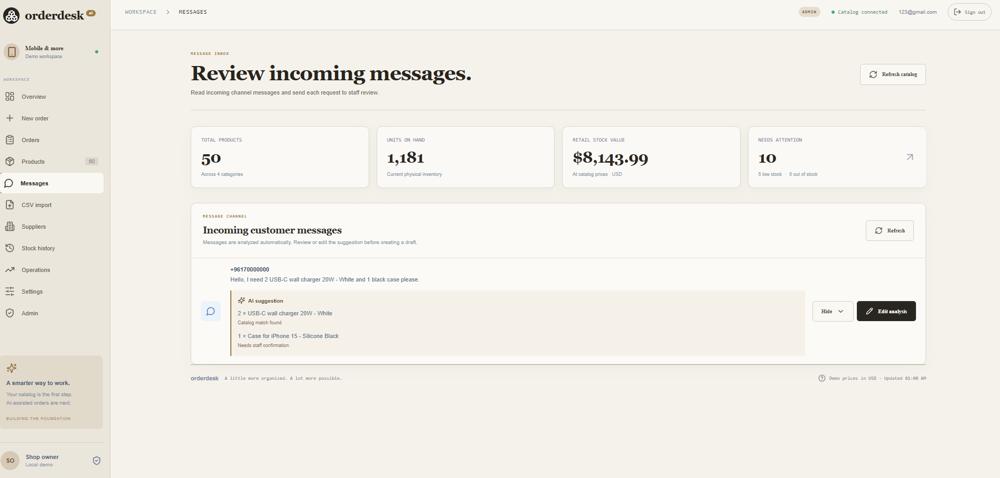
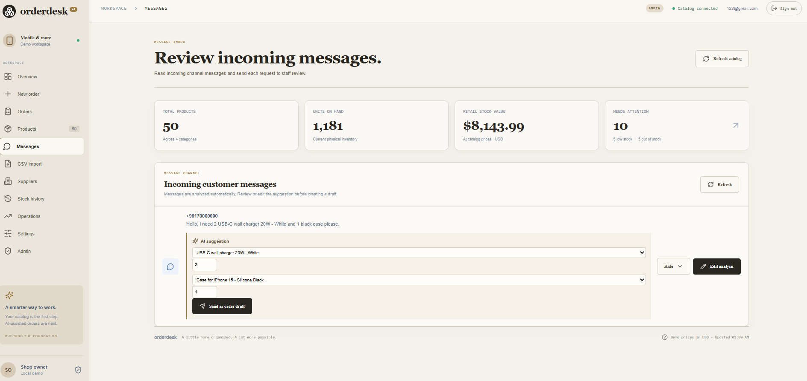
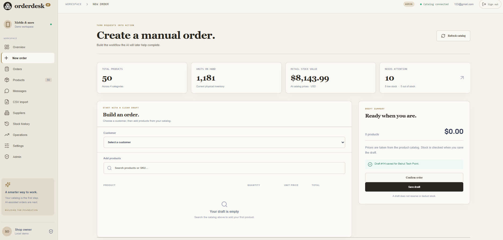
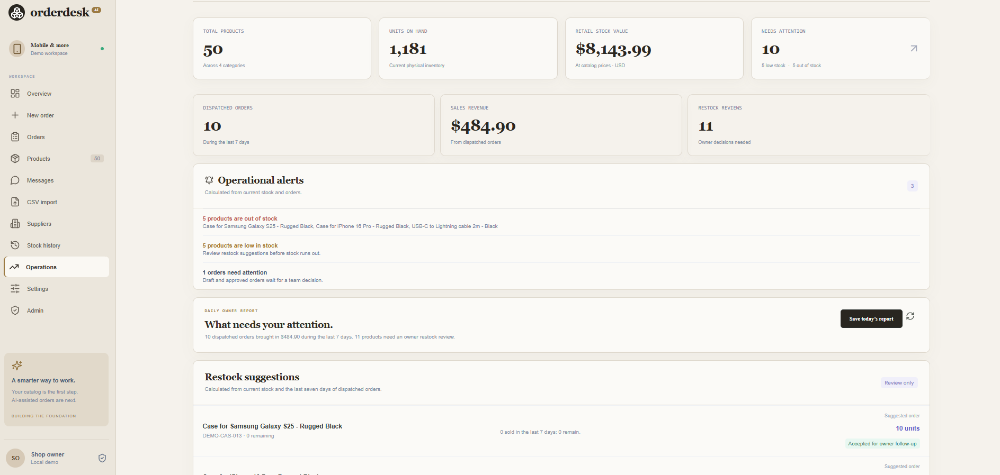
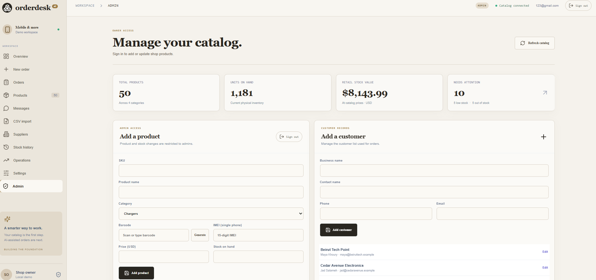

# AI Order Desk

**AI Order Desk** is a portfolio project for a small cellphone shop. It turns customer messages into staff-reviewed order drafts, protects stock calculations with normal backend rules, and gives the owner a clear view of inventory and sales.

> AI suggests. People decide. The system never approves orders, dispatches stock, or buys products automatically.

## What it solves

Small retailers often manage product requests, stock, and customer conversations across chat apps and handwritten notes. AI Order Desk brings that work into one workspace:

- Read a customer request and suggest matching products
- Let staff correct every AI suggestion before saving an order
- Reserve stock on approval and deduct it only at dispatch
- Alert the owner about low stock and unusual situations
- Import catalog changes safely from CSV files
- Record stock movement and import history for review

## Main features

- Admin and staff accounts with protected access
- Searchable catalog with 50 fictional phone-shop products
- Manual order workflow: **draft → approved → dispatched / cancelled**
- Deterministic totals and stock validation using integer cents
- Automatic social-message analysis with editable product matches and quantities inside the team inbox
- Staff send reviewed message suggestions directly into a prefilled New Order draft
- Daily operations report, restock suggestions, alerts, and sales signals
- Owner-reviewed ready-to-order queue
- Supplier directory for manual restock follow-up
- CSV import preview, confirmation, and import history
- Stock movement audit history

## Demo flow

1. A customer message arrives through a connected social channel and is analyzed automatically.
2. Open **Messages**, review the AI suggestion, and edit any product or quantity.
3. Send the reviewed suggestion to **New Order**, select the customer, and save the draft.
4. Confirm the order to reserve stock, then confirm dispatch to deduct it.
5. Open **Stock history** to see the logged stock deduction.
6. Open **Operations** to review alerts, sales signals, and owner-approved restock items.
7. Open **CSV import** and preview `sample-data/product-import-template.csv` before confirming an update.


## Architecture



## Screenshots and video


*Dashboard overview: catalog totals, category mix, and low-stock attention list.*


*Incoming social message with automatic AI product suggestions.*


*Staff can correct the suggested products and quantities before making a draft.*


*Order workspace with confirmation and dispatch controls.*


*Owner operations view with alerts, sales signals, and restock reviews.*


*Admin product entry with barcode generation and IMEI support.*

**Optional demo video:** Add a YouTube, Loom, or Google Drive link here if you later decide to record the 90-second walkthrough.

## Stack

- **Backend:** Python, FastAPI, SQLAlchemy, Pydantic
- **Frontend:** React, TypeScript, Vite
- **Database:** SQLite
- **Tests:** pytest

## Local setup

Prerequisites: Python 3.14+, Node.js with npm, and Git. On Windows, use `py` if `python` opens the Microsoft Store.

```bash
cd backend
py -m venv .venv
.\.venv\Scripts\python.exe -m pip install -r requirements.txt
.\.venv\Scripts\python.exe -m uvicorn app.main:app --host 127.0.0.1 --port 8000
```

In a second terminal:

```bash
cd frontend
npm install
npm run dev
```

Open `http://127.0.0.1:5173`, choose **Team workspace**, and create the first owner account. The backend API documentation is available at `http://127.0.0.1:8000/docs`.


## Verification

```bash
cd backend
.\.venv\Scripts\python.exe -m pytest -q

cd ..\frontend
npm run build
```

## Scope and safety

All sample data is fictional. The app uses AI only to interpret customer messages and propose product matches. Stock, money, approval, dispatch, and cancellation stay in deterministic backend code and require a human action.

## Future work

- Real WhatsApp Business and social-media integrations
- Supplier purchase-order drafts
- Password reset and more detailed staff roles
- 30-day/custom sales reports and charts
- GitHub Actions checks for automated verification


